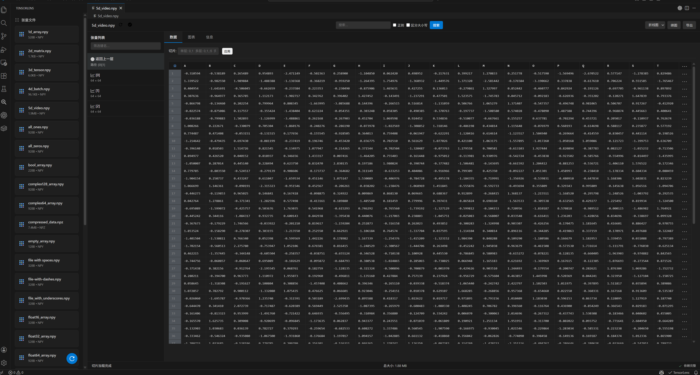

# TensorLens - Tensor & Archive Preview

<p align="center">
  
  
  
  
</p>

<p align="center">
  <b>A powerful VS Code extension for previewing and analyzing tensor files and archives</b><br>
  <i>一款功能强大的 VS Code 插件，用于预览和分析张量文件与压缩包</i>
</p>

<p align="center">
  Support NumPy (.npz, .npy) | PyTorch (.pt, .pth) | ZIP | RAR | 7Z
</p>

---

## 📸 Interface Preview / 界面预览

<p align="center">
  
</p>

<p align="center">
  <i>TensorLens Main Interface - Multi-dimensional tensor navigation, data editing, plotting and search</i><br>
  <i>TensorLens 主界面 - 支持多维张量导航、数据编辑、绘图和搜索功能</i>
</p>

---

## 🌏 Language / 语言

This extension supports bilingual interface (Chinese & English)!
本插件支持中英文双语界面！

**Switch Language / 切换语言:**
1. Press `Ctrl+Shift+P` / 按下 `Ctrl+Shift+P`
2. Type "Switch Language" / 输入 "Switch Language"
3. Select your language / 选择你的语言

Or configure `tensorLens.language` in settings
或在设置中配置 `tensorLens.language`

**Read this in other languages:**
- [中文文档](README.md)
- [English](README_en.md)

---

## ✨ Features

### 🔢 Tensor File Preview
- **Multi-format Support**: NumPy (`.npz`, `.npy`) and PyTorch (`.pt`, `.pth`)
- **Data Table**: Display tensor data in table format with slicing support
- **Statistical Analysis**: Shape, dtype, min/max values, mean, standard deviation
- **Visualization Charts**: 
  - 📈 Line, Bar, Scatter plots
  - 🔥 Heatmap, Histogram
  - 🖼️ Image visualization
- **Advanced Search**: Regular expressions, case sensitivity
- **Data Export**: CSV, JSON, NPY, PNG, TXT

### 📦 Archive File Preview
- **Multi-format Support**: ZIP, RAR, 7Z, TAR, GZ
- **File Tree Browser**: Intuitive directory structure display
- **Online Preview**: 
  - Code syntax highlighting
  - Image instant preview
  - Binary HEX display
- **One-click Extract**: Multiple extraction path options

---

## 📦 Installation

### VS Code Marketplace
1. Open VS Code → `Ctrl+Shift+X`
2. Search "TensorLens"
3. Click Install

### Manual Installation
```bash
code --install-extension tensorlens-0.1.0.vsix
```

## 🔧 Dependencies

| Dependency | Purpose | Required |
|------------|---------|----------|
| Python 3.7+ | Runtime Environment | ✅ |
| NumPy | Read .npz/.npy | ✅ |
| PyTorch | Read .pt/.pth | ⭕ Optional |
| 7-Zip | RAR/7Z extraction | ⭕ Optional |

### Python Environment Management

TensorLens automatically detects the Python environment on first launch:

- **No Python**: Prompts to install Python 3.7+
- **Python Installed**: Asks whether to create a dedicated virtual environment
  - **Recommended**: Create virtual environment (avoid dependency conflicts)
  - **Optional**: Use system Python environment

#### Manual Virtual Environment Creation
```bash
# TensorLens creates .tensorlens-venv in workspace
# Or run command manually: TensorLens: Create Python Virtual Environment
```

#### Install Dependencies
```bash
pip install numpy torch
```

## 🚀 Quick Start

### Development Environment Setup

Clone from GitHub and install:

```bash
# 1. Clone the project locally
git clone https://github.com/gmkrxb/tensorlens.git

# 2. Enter project directory
cd tensorlens

# 3. Install project dependencies (download node_modules)
npm install
```

### NPM Script Commands

| Command | Description | Purpose |
|---------|-------------|----------|
| `npm run compile` | Compile TypeScript code | Compile .ts files in src/ to JavaScript |
| `npm run watch` | Watch mode compilation | Auto-recompile on file changes (for development) |
| `npm run lint` | Code quality check | Check code standards with ESLint |
| `npm test` | Run tests | Execute extension test suite |
| `npm run package` | Package extension | Generate .vsix installation package |
| `npm run install-extension` | Install extension | Install packaged extension to VS Code |
| `npm run vscode:prepublish` | Pre-publish preparation | Auto-compile (runs automatically when packaging) |

### Complete Development Workflow

```bash
# Development & Debugging
npm run watch          # Start watch mode, auto-compile
# Press F5 in VS Code to start debugging

# Code Quality Check
npm run lint           # Check code quality

# Package & Install
npm run package        # Package as .vsix file
npm run install-extension  # Install to VS Code
```

### Usage Steps

1. **Tensor Files**: Double-click `.npz`/`.pt` files to automatically open preview
2. **Archive Files**: Double-click `.zip`/`.rar` files to browse contents
3. **Plotting**: Select tensor → Choose chart type → Click "Plot"
4. **Extract**: Right-click file/directory → Select extraction option
5. **Language Switch**: `Ctrl+Shift+P` → "Switch Language"
### Command Palette Commands

Press `Ctrl+Shift+P` (or `F1`) to open command palette and type:

| Command | Description | Use Case |
|---------|-------------|----------|
| `TensorLens: Open Tensor File Preview` | Open and preview tensor files | Manually select .npz/.npy/.pt/.pth files |
| `TensorLens: Preview Archive Content` | Browse archive contents | View internal structure of .zip/.rar/.7z files |
| `TensorLens: Extract Archive` | Extract archive to specified directory | Extract archive contents locally |
| `TensorLens: Check Dependency Status` | Check Python/NumPy/PyTorch/7-Zip status | Diagnose environment issues |
| `TensorLens: Install Python Dependency` | Install NumPy or PyTorch | Add missing Python packages |
| `TensorLens: Create Virtual Environment` | Create isolated virtual environment for project | Isolate project dependencies |
| `TensorLens: Switch Language` | Switch between Chinese/English interface | Change interface language |
## ⚙️ Configuration

```json
{
  "tensorLens.pythonPath": "python",
  "tensorLens.maxPreviewSize": 10000,
  "tensorLens.defaultChartType": "line",
  "tensorLens.language": "en"
}
```

## 📁 Project Structure

```
tensorlens/
├── src/                          # Source code directory
│   ├── extension.ts             # Extension entry point
│   ├── locales/                 # Internationalization
│   │   ├── zh-cn/              # Chinese translation modules
│   │   │   ├── index.ts        # Export entry
│   │   │   ├── common.ts       # Common texts
│   │   │   ├── dependency.ts   # Dependency management
│   │   │   ├── commands.ts     # Commands
│   │   │   ├── language.ts     # Language settings
│   │   │   ├── editor.ts       # Editors
│   │   │   └── config.ts       # Configuration
│   │   └── en/                 # English translation modules
│   │       └── ...             # Same structure as above
│   ├── services/               # Business services
│   │   ├── dependencyChecker.ts  # Dependency detection
│   │   ├── tensorService.ts      # Tensor processing
│   │   └── archiveService.ts     # Archive processing
│   ├── editors/                # Custom editors
│   │   ├── tensorEditor.ts     # Tensor editor
│   │   └── archiveEditor.ts    # Archive editor
│   ├── commands/               # Command handlers
│   │   ├── index.ts
│   │   ├── tensorCommands.ts
│   │   └── archiveCommands.ts
│   ├── utils/                  # Utility functions
│   │   ├── i18n.ts            # i18n manager
│   │   └── index.ts
│   ├── types/                  # Type definitions
│   │   └── index.ts
│   └── webview/                # WebView management
│       └── webviewManager.ts
├── media/                       # Static assets
│   ├── templates/              # HTML templates
│   │   ├── tensorViewer.html
│   │   └── archiveViewer.html
│   ├── tensorViewer.js         # Tensor viewer frontend
│   ├── archiveViewer.js        # Archive viewer frontend
│   ├── icons.js                # SVG icons
│   └── style.css               # Stylesheets
├── scripts/                     # Helper scripts
│   ├── tensor_handler.py       # Python tensor handler
│   └── github_push.py          # Git push script (local only)
├── package.json                 # Extension manifest
├── tsconfig.json               # TypeScript config
├── README.md                    # Chinese documentation
├── README_en.md                 # English documentation
└── LICENSE                      # MIT License
```

## 🛠️ Development

### Quick Start

```bash
git clone https://github.com/gmkrxb/tensorlens.git
cd tensorlens
npm install
npm run compile
```

### Available Scripts

#### `npm run compile`
Compile TypeScript code to JavaScript.
- Uses `tsc` compiler
- Output directory: `./dist`
- Required before publishing

#### `npm run watch`
Run TypeScript compiler in watch mode.
- Automatically recompile on file changes
- Suitable for development
- Uses `tsc -watch`

#### `npm run lint`
Run ESLint to check code quality.
- Checks TypeScript files in `src` directory
- Follows project coding standards
- Can auto-fix some issues (add `--fix` flag)

#### `npm test`
Run the extension test suite.
- Executes `./out/test/runTest.js`
- Ensures functionality works correctly

#### `npm run vscode:prepublish`
Prepublish script for release.
- Automatically runs `npm run compile`
- Executed automatically when packaging extension

#### `npm run package`
Package extension as .vsix file.
- Automatically reads version from package.json
- Generates `tensorlens-{version}.vsix` file
- Equivalent to `npx vsce package`

#### `npm run install-extension`
Install the packaged extension to VS Code.
- Automatically uses version from package.json
- Installs `tensorlens-{version}.vsix` file
- Requires running `npm run package` first to generate .vsix file

### Complete Workflow

```bash
# Develop → Package → Install
npm run compile    # Compile code
npm run package    # Package extension
npm run install-extension  # Install to VS Code
```

### Package Extension (Old Way)

```bash
npx vsce package
```

Generates `.vsix` file for local installation or marketplace publishing.

## 🎯 Key Features

### Automated Environment Configuration
- ✅ Automatic Python environment detection
- ✅ Virtual environment creation and management
- ✅ Smart environment selection (prioritize virtual environment)
- ✅ Automatic dependency detection (Python, NumPy, PyTorch, 7-Zip)

### Dependency Management
- ✅ Python environment detection
- ✅ NumPy installation support
- ✅ PyTorch installation support
- ✅ 7-Zip detection and one-click installation
  - Windows: winget install / Official website download
  - Linux/Mac: Package manager installation

### Internationalization (i18n)
- ✅ Bilingual support (Chinese & English)
- ✅ Language switch command
- ✅ Local cache language settings
- ✅ Auto-detect system language
- ✅ All UI text internationalized

## 📝 Changelog

### v0.1.0 (Feb 4, 2026 / 2026年2月4日)

🎉 **First Generation Release! First Feature-Complete Preview**  
🎉 **初代版本发布！首个功能完整的预览版本**

#### ✨ Core Features / 核心功能

**Tensor File Preview / 张量文件预览:**
- ✅ Support for NumPy (`.npz`, `.npy`) and PyTorch (`.pt`, `.pth`) formats
- ✅ Multi-dimensional array tree navigation system (supports N-dimensional tensor layer-by-layer browsing)
- ✅ Table-style data display with manual slice input
- ✅ Data editing and saving functionality (complete dtype validation)
- ✅ Statistical information: shape, data type, max/min values, mean, standard deviation
- ✅ Search functionality: supports key name and data value search
- ✅ Plotting functionality: line, bar, scatter, heatmap, histogram charts
- ✅ Real-time chart type switching
- ✅ Data export: CSV, JSON, NPY formats

**Archive File Preview / 压缩文件预览:**
- ✅ Support for ZIP, RAR, 7Z, TAR, GZ formats
- ✅ File tree browser (hierarchical directory structure)
- ✅ Online preview: code syntax highlighting, instant image preview, binary HEX display
- ✅ One-click extraction functionality

**Environment Management / 环境管理:**
- ✅ Automatic detection of Python, NumPy, PyTorch, 7-Zip dependencies
- ✅ Python version detection (via Python Extension API)
- ✅ Dynamic dependency status updates
- ✅ Friendly error messages with format examples

**User Interface / 用户界面:**
- ✅ SVG icon system (replacing emoji)
- ✅ Bilingual support (Chinese & English)
- ✅ UTF-8 encoding support throughout
- ✅ Detailed operation logging

#### 🐛 Known Issues / 已知问题

##### 1. Chart Switching Issue / 图表切换问题
- **Problem:**  
  When directly switching between all chart types, the display may be abnormal.
  
- **Workaround:**  
  Need to open the plot parameter settings panel first, then switch chart types for normal display.
  
- **Status:** To be fixed

##### 2. Search Function Failure / 搜索功能失效
- **Problem:**  
  Search operations may fail or return no results. Overall search functionality is unstable.
  
- **Impact:**  
  Unable to normally search tensor key names and data values.
  
- **Status:** To be fixed

##### 3. Export Button Disabled / 导出按钮失效
- **Problem:**  
  The export button on the right side of the plotting interface has unclear purpose and doesn't respond to clicks.
  
- **Workaround:**  
  Use the camera icon in the chart toolbar for screenshot export.
  
- **Status:** To be fixed or removed

## 👤 Author

**Mark Gu** | [Blog](https://life.gumingke.cloud) | [Email](mailto:gmk@gumingke.cloud) | [IOMI Team](https://iomi.team)

## 📄 License

[MIT License](LICENSE) © 2024 Mark Gu & IOMI Team

---

<p align="center">
  Made with ❤️ by <a href="https://iomi.team">IOMI Team</a>
</p>
